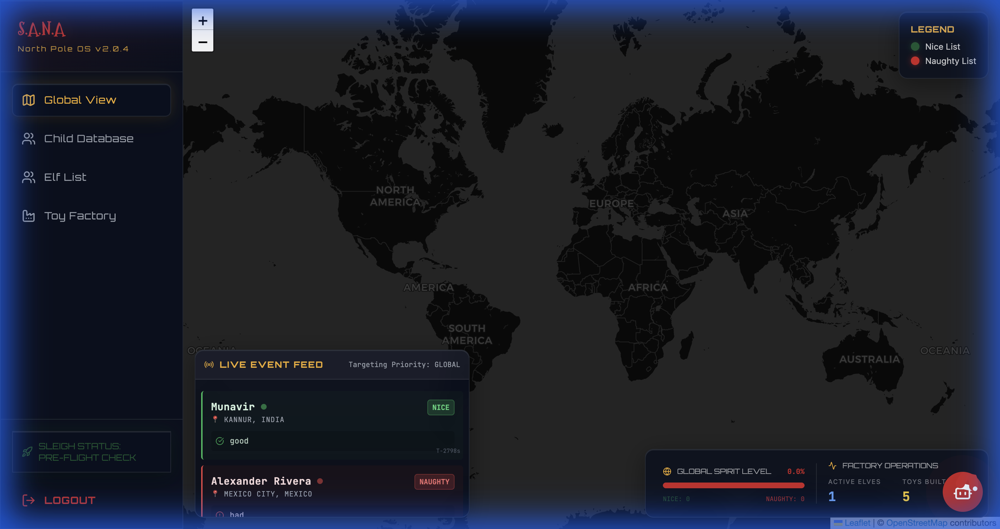

# S.A.N.A - Santa's Autonomous Network Agent
> **"Santa Claus doesn't need a list. He needs a System."**



## 🎄 The Concept (Tech Upgrade)
For centuries, the North Pole ran on paper scrolls and elf-whispers. In 2025, that ends.
**S.A.N.A** is a distributed **Enterprise Resource Planning (ERP)** system designed to automate Global Spirit Tracking and Gift Manufacturing.

It is not just a website. It is a **Microservices Ecosystem** where independent agents negotiate the fate of Christmas in real-time.

## 🚀 Features (Why this wins)
- **Real Interactive Map**: Track global request demand using Leaflet maps. Click pins to see Child profiles.
- **Global Children Database**: A searchable, real-time database of every child. Filter by name and toggle "Naughty/Nice" status instantly.
- **Factory Automation**: Interactive "Logistics" dashboard to approve production batches manually.
- **Event-Driven Architecture**: "Naughty" and "Nice" actions are processed as discrete events across microservices.

## 🛠️ Tech Stack (The "Flex")
This project is built as a **Monorepo** using modern engineering standards:

- **Architecture**: Microservices (Node.js + Express)
- **Frontend**: React (v18) + Vite + TypeScript + React Router + Leaflet
- **Styling**: Tailwind CSS (Custom "Cyber-Christmas" Theme)
- **Communication**: REST / Webhooks (Simulation)
- **Visuals**: Lucide Icons + Glassmorphism UI

## 📂 Project Structure
```bash
sana-monorepo/
├── packages/
│   ├── behavior-service/  # The "Eyes". Generates child events & manages Database API.
│   ├── logistics-service/ # The "Hands". Manages factory inventory.
│   └── command-center/    # The "Face". Multi-page React Dashboard.
```

## 🔧 Setup Instructions
We made it easy to run the entire super-computer locally.

1. **Install Dependencies**
   ```bash
   npm install
   ```
2. **Launch the System**
   ```bash
   npm run start:all
   ```
   *This will boot up all 3 microservices concurrently.*
3. **Access Command Center**
   Open `http://localhost:5173` to view the dashboard.

## 🤖 AI Usage Declaration
This project utilizes AI for:
- Generating "Cyberpunk" UI asset ideas.
- Optimizing the Event Loop logic.
- Code scaffolding for the microservice boilerplate.

---
*Built with ❤️ (and 100% Caffeine) for Santakku Oru App Hackathon.*
